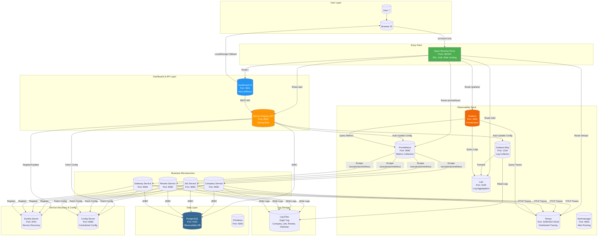
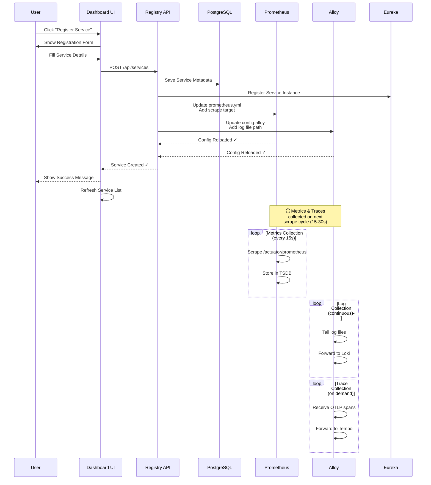
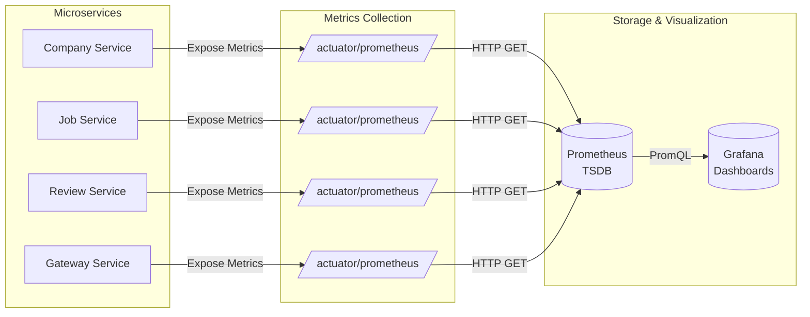
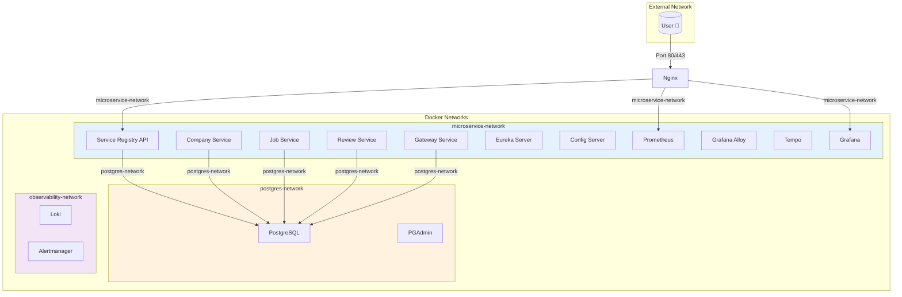
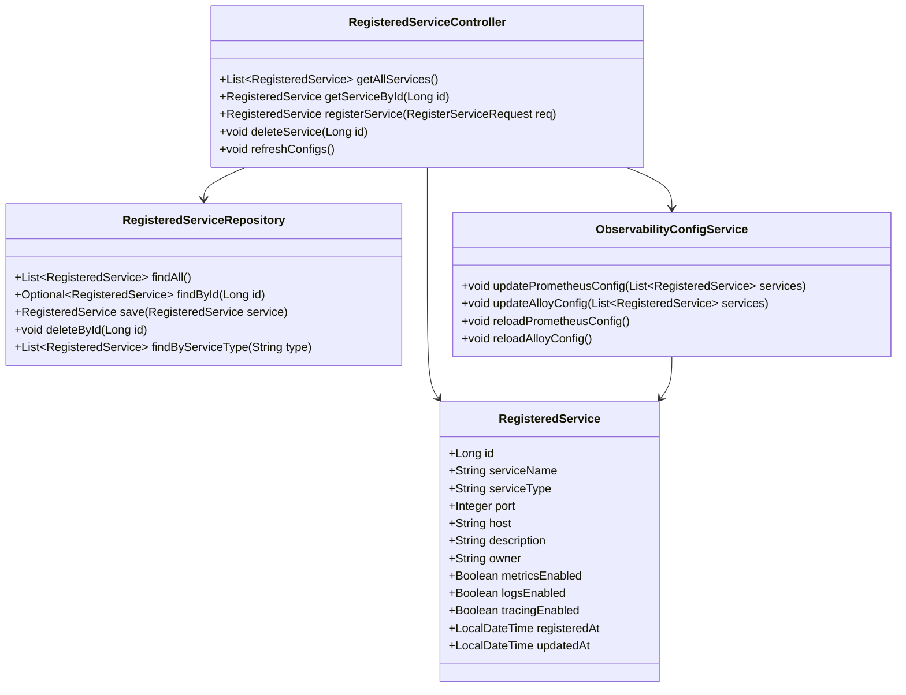
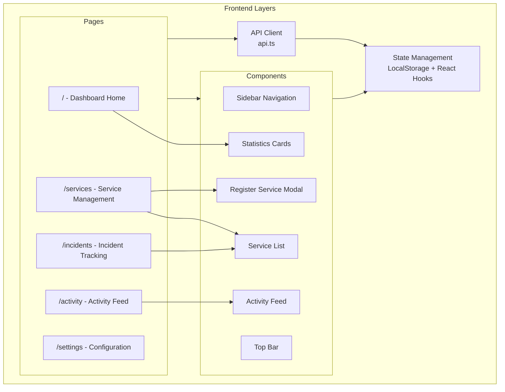
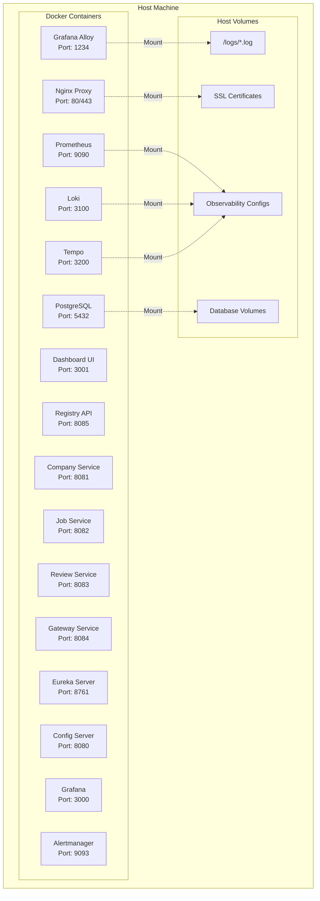
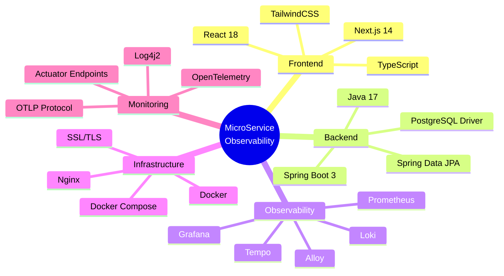

# MicroService Observatory Platform - Architecture Diagram

## System Overview



## Service Registration Flow



## Data Flow - Metrics



## Data Flow - Logs

```mermaid
flowchart LR
    subgraph "Microservices"
        MS1[Company Service]
        MS2[Job Service]
        MS3[Review Service]
        MS4[Gateway Service]
        US1[User-Registered Service]
    end

    subgraph "Log Files"
        LF1[/logs/company.log/]
        LF2[/logs/job.log/]
        LF3[/logs/review.log/]
        LF4[/logs/gateway.log/]
        LF5[/logs/user-service.log/]
    end

    subgraph "Log Pipeline"
        Alloy[Grafana Alloy<br/>Log Collector]
        Loki[(Loki<br/>Log Storage)]
        Grafana[(Grafana<br/>LogQL)]
    end

    MS1 -->|Write| LF1
    MS2 -->|Write| LF2
    MS3 -->|Write| LF3
    MS4 -->|Write| LF4
    US1 -->|Write| LF5

    LF1 -->|Read| Alloy
    LF2 -->|Read| Alloy
    LF3 -->|Read| Alloy
    LF4 -->|Read| Alloy
    LF5 -->|Read| Alloy

    Note over Alloy: ⏱️ Alloy tails logs<br/>after service<br/>writes them

    Alloy -->|Push (batch)| Loki
    Loki -->|Query| Grafana
```

## Data Flow - Traces

```mermaid
flowchart LR
    subgraph "Microservices"
        MS1[Company Service<br/>OTel Agent]
        MS2[Job Service<br/>OTel Agent]
        MS3[Review Service<br/>OTel Agent]
        MS4[Gateway Service<br/>OTel Agent]
        US1[User-Registered Service<br/>OTel Agent]
    end

    subgraph "Trace Collection"
        Tempo[(Tempo<br/>Trace Storage)]
        Grafana[(Grafana<br/>Trace Visualization)]
    end

    MS1 -->|OTLP /v1/traces| Tempo
    MS2 -->|OTLP /v1/traces| Tempo
    MS3 -->|OTLP /v1/traces| Tempo
    MS4 -->|OTLP /v1/traces| Tempo
    US1 -->|OTLP /v1/traces| Tempo

    Note over MS1: ⏱️ Traces sent<br/>after requests<br/>complete

    Tempo -->|Search/View| Grafana
```

## Network Architecture



## Component Details

### Service Registry API



### Dashboard UI Architecture



## Deployment Architecture



## Technology Stack


