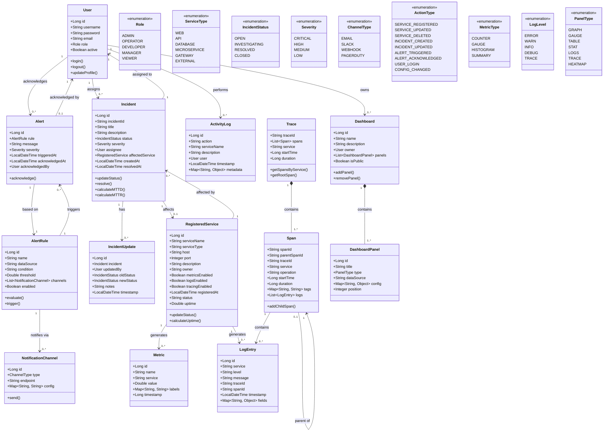

# Class Diagram - Incident Management System Platform

## System Overview

This document describes the class structure and relationships for the Incident Management System Platform.

---

## Class Diagram

---

## Class Descriptions

### **User Management**

#### **User**
Represents a system user with authentication and authorization.

**Attributes:**
- `id`: Unique identifier
- `username`: Login username
- `password`: Hashed password
- `email`: User email
- `role`: User role (ADMIN, OPERATOR, etc.)
- `active`: Account active status

**Methods:**
- `login()`: Authenticate user
- `logout()`: End user session
- `updateProfile()`: Update user information

---

#### **Role** (Enumeration)
User roles for access control.

**Values:**
- `ADMIN`: Full system access
- `OPERATOR`: Incident management access
- `DEVELOPER`: Service debugging access
- `MANAGER`: Report and analytics access
- `VIEWER`: Read-only access

---

### **Service Management**

#### **RegisteredService**
Represents a monitored microservice.

**Attributes:**
- `id`: Unique identifier
- `serviceName`: Service name
- `serviceType`: Type of service
- `host`: Service hostname/IP
- `port`: Service port
- `description`: Service description
- `owner`: Service owner/team
- `metricsEnabled`: Metrics collection enabled
- `logsEnabled`: Log collection enabled
- `tracingEnabled`: Trace collection enabled
- `registeredAt`: Registration timestamp
- `status`: Current health status
- `uptime`: Uptime percentage

**Methods:**
- `updateStatus()`: Update service health status
- `calculateUptime()`: Calculate uptime percentage

---

#### **ServiceType** (Enumeration)
Types of services that can be registered.

**Values:**
- `WEB`: Web application
- `API`: REST/GraphQL API
- `DATABASE`: Database service
- `MICROSERVICE`: Microservice
- `GATEWAY`: API Gateway
- `EXTERNAL`: External service

---

### **Incident Management**

#### **Incident**
Represents an operational incident.

**Attributes:**
- `id`: Unique identifier
- `incidentId`: Human-readable ID (INC-2026-001)
- `title`: Incident title
- `description`: Incident description
- `status`: Current status
- `severity`: Incident severity
- `assignee`: Assigned user
- `affectedService`: Affected service
- `createdAt`: Creation timestamp
- `resolvedAt`: Resolution timestamp

**Methods:**
- `updateStatus()`: Update incident status
- `resolve()`: Resolve incident
- `calculateMTTD()`: Calculate mean time to detect
- `calculateMTTR()`: Calculate mean time to resolve

---

#### **IncidentStatus** (Enumeration)
Incident lifecycle states.

**Values:**
- `OPEN`: Newly created
- `INVESTIGATING`: Being investigated
- `RESOLVED`: Issue resolved
- `CLOSED`: Incident closed

---

#### **Severity** (Enumeration)
Incident severity levels.

**Values:**
- `CRITICAL`: System down, major impact
- `HIGH`: Major functionality impaired
- `MEDIUM`: Minor functionality impaired
- `LOW`: Minimal impact

---

#### **IncidentUpdate**
Records changes to an incident.

**Attributes:**
- `id`: Unique identifier
- `incident`: Parent incident
- `updatedBy`: User who made update
- `oldStatus`: Previous status
- `newStatus`: New status
- `notes`: Update notes
- `timestamp`: Update timestamp

---

### **Alerting**

#### **AlertRule**
Defines conditions for triggering alerts.

**Attributes:**
- `id`: Unique identifier
- `name`: Rule name
- `dataSource`: Data source (metrics/logs)
- `condition`: Condition expression
- `threshold`: Threshold value
- `channels`: Notification channels
- `enabled`: Rule enabled status

**Methods:**
- `evaluate()`: Evaluate condition
- `trigger()`: Trigger alert

---

#### **Alert**
Represents a triggered alert.

**Attributes:**
- `id`: Unique identifier
- `rule`: Triggering rule
- `message`: Alert message
- `severity`: Alert severity
- `triggeredAt`: Trigger timestamp
- `acknowledgedAt`: Acknowledgment timestamp
- `acknowledgedBy`: User who acknowledged

**Methods:**
- `acknowledge()`: Acknowledge alert

---

#### **NotificationChannel**
Defines where to send notifications.

**Attributes:**
- `id`: Unique identifier
- `type`: Channel type (EMAIL, SLACK, etc.)
- `endpoint`: Endpoint URL/address
- `config`: Channel-specific configuration

**Methods:**
- `send()`: Send notification

---

#### **ChannelType** (Enumeration)
Notification channel types.

**Values:**
- `EMAIL`: Email notification
- `SLACK`: Slack message
- `WEBHOOK`: HTTP webhook
- `PAGERDUTY`: PagerDuty incident

---

### **Activity Logging**

#### **ActivityLog**
Records user and system activities.

**Attributes:**
- `id`: Unique identifier
- `action`: Action type
- `serviceName`: Related service
- `description`: Activity description
- `user`: User who performed action
- `timestamp`: Activity timestamp
- `metadata`: Additional metadata

---

#### **ActionType** (Enumeration)
Types of actions that can be logged.

**Values:**
- `SERVICE_REGISTERED`: Service registration
- `SERVICE_UPDATED`: Service update
- `SERVICE_DELETED`: Service deletion
- `INCIDENT_CREATED`: Incident creation
- `INCIDENT_UPDATED`: Incident update
- `ALERT_TRIGGERED`: Alert triggered
- `ALERT_ACKNOWLEDGED`: Alert acknowledged
- `USER_LOGIN`: User login
- `CONFIG_CHANGED`: Configuration change

---

### **Observability Data**

#### **Metric**
Represents a metrics data point.

**Attributes:**
- `id`: Unique identifier
- `name`: Metric name
- `service`: Source service
- `value`: Metric value
- `labels`: Metric labels
- `timestamp`: Data point timestamp

---

#### **MetricType** (Enumeration)
Prometheus metric types.

**Values:**
- `COUNTER`: Cumulative counter
- `GAUGE`: Point-in-time value
- `HISTOGRAM`: Distribution histogram
- `SUMMARY`: Statistical summary

---

#### **LogEntry**
Represents a log entry.

**Attributes:**
- `id`: Unique identifier
- `service`: Source service
- `level`: Log level
- `message`: Log message
- `traceId`: Associated trace ID
- `spanId`: Associated span ID
- `timestamp`: Log timestamp
- `fields`: Structured fields

---

#### **LogLevel** (Enumeration)
Log severity levels.

**Values:**
- `ERROR`: Error condition
- `WARN`: Warning condition
- `INFO`: Informational
- `DEBUG`: Debug information
- `TRACE`: Trace information

---

#### **Trace**
Represents a distributed trace.

**Attributes:**
- `traceId`: Unique trace identifier
- `spans`: List of spans
- `service`: Root service
- `startTime`: Trace start time
- `duration`: Total duration

**Methods:**
- `getSpansByService()`: Get spans grouped by service
- `getRootSpan()`: Get root span

---

#### **Span**
Represents a span within a trace.

**Attributes:**
- `spanId`: Unique span identifier
- `parentSpanId`: Parent span ID
- `traceId`: Parent trace ID
- `service`: Service name
- `operation`: Operation name
- `startTime`: Span start time
- `duration`: Span duration
- `tags`: Span tags
- `logs`: Span logs

**Methods:**
- `addChildSpan()`: Add child span

---

### **Dashboard**

#### **Dashboard**
Represents a custom dashboard.

**Attributes:**
- `id`: Unique identifier
- `name`: Dashboard name
- `description`: Dashboard description
- `owner`: Dashboard owner
- `panels`: Dashboard panels
- `isPublic`: Public visibility

**Methods:**
- `addPanel()`: Add panel to dashboard
- `removePanel()`: Remove panel from dashboard

---

#### **DashboardPanel**
Represents a panel within a dashboard.

**Attributes:**
- `id`: Unique identifier
- `title`: Panel title
- `type`: Panel type
- `dataSource`: Data source
- `config`: Panel configuration
- `position`: Panel position

---

#### **PanelType** (Enumeration)
Dashboard panel types.

**Values:**
- `GRAPH`: Time series graph
- `GAUGE`: Gauge meter
- `TABLE`: Data table
- `STAT`: Single statistic
- `LOGS`: Log viewer
- `TRACE`: Trace viewer
- `HEATMAP`: Heat map

---

## Relationships

### **Associations**

| From | To | Cardinality | Description |
|------|-----|-------------|-------------|
| User | Incident | 1 → 0..* | User assigned to incidents |
| User | ActivityLog | 1 → 0..* | User performs activities |
| User | Dashboard | 1 → 0..* | User owns dashboards |
| RegisteredService | Incident | 1 → 0..* | Service affected by incidents |
| RegisteredService | Metric | 1 → 0..* | Service generates metrics |
| Incident | IncidentUpdate | 1 → 0..* | Incident has updates |
| AlertRule | NotificationChannel | 1 → 0..* | Rule uses channels |
| AlertRule | Alert | 1 → 0..* | Rule triggers alerts |
| Trace | Span | 1 → 1..* | Trace contains spans |
| Dashboard | DashboardPanel | 1 → 1..* | Dashboard contains panels |

### **Compositions**

| Whole | Part | Description |
|-------|------|-------------|
| Trace | Span | Spans cannot exist without trace |
| Dashboard | DashboardPanel | Panels belong to dashboard |

### **Inheritance**

None - All classes are concrete implementations.

---

## Design Patterns Used

### **1. Repository Pattern**
- Data access abstracted through repositories
- Example: `IncidentRepository`, `ServiceRepository`

### **2. Observer Pattern**
- Alert rules observe metrics/logs
- Notifications sent when conditions met

### **3. Strategy Pattern**
- Different notification strategies (Email, Slack, Webhook)
- Interchangeable notification channels

### **4. Factory Pattern**
- Dashboard panel factory creates appropriate panel types
- Alert factory creates alerts based on rules

### **5. Singleton Pattern**
- Configuration manager
- Metrics registry

---

## Database Mapping

| Class | Table | Primary Key | Foreign Keys |
|-------|-------|-------------|--------------|
| User | users | id | - |
| RegisteredService | registered_services | id | - |
| Incident | incidents | id | assignee_id, service_id |
| IncidentUpdate | incident_updates | id | incident_id, user_id |
| AlertRule | alert_rules | id | - |
| Alert | alerts | id | rule_id, acknowledged_by_id |
| NotificationChannel | notification_channels | id | - |
| ActivityLog | activity_logs | id | user_id |
| Dashboard | dashboards | id | owner_id |
| DashboardPanel | dashboard_panels | id | dashboard_id |

---

## Document Information

| Field | Value |
|-------|-------|
| **Document** | Class Diagram |
| **Version** | 1.0 |
| **Date** | May 2026 |
| **Author** | [Your Name] |

---

**End of Class Diagram Document**
