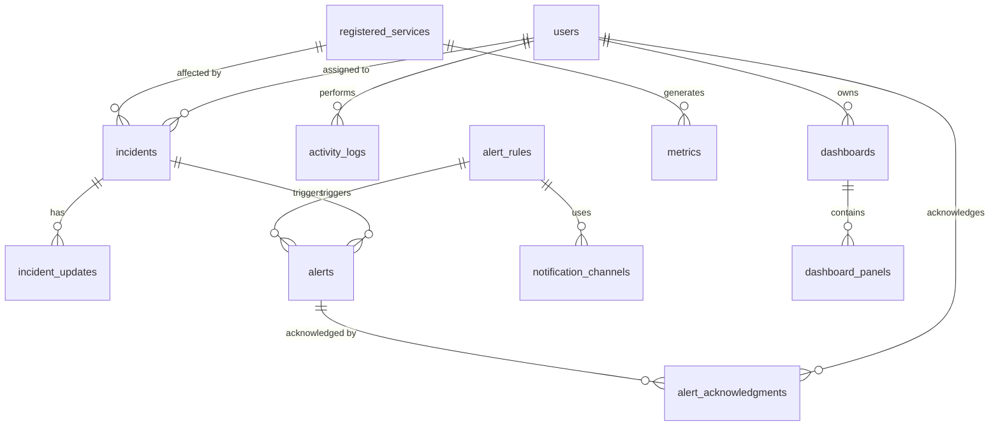

# Database Schema - Incident Management System Platform

## System Overview

This document describes the database schema for the Incident Management System Platform using PostgreSQL.

---

## Entity Relationship Diagram



---

## Table Definitions

### **users**

Stores user accounts and authentication information.

```sql
CREATE TABLE users (
    id BIGSERIAL PRIMARY KEY,
    username VARCHAR(50) UNIQUE NOT NULL,
    password_hash VARCHAR(255) NOT NULL,
    email VARCHAR(100) UNIQUE NOT NULL,
    role VARCHAR(20) NOT NULL CHECK (role IN ('ADMIN', 'OPERATOR', 'DEVELOPER', 'MANAGER', 'VIEWER')),
    active BOOLEAN DEFAULT true,
    created_at TIMESTAMP DEFAULT CURRENT_TIMESTAMP,
    updated_at TIMESTAMP DEFAULT CURRENT_TIMESTAMP,
    last_login_at TIMESTAMP
);

CREATE INDEX idx_users_username ON users(username);
CREATE INDEX idx_users_email ON users(email);
CREATE INDEX idx_users_role ON users(role);
```

**Columns:**
- `id`: Primary key
- `username`: Unique username for login
- `password_hash`: BCrypt hashed password
- `email`: User email address
- `role`: User role (enum)
- `active`: Account active status
- `created_at`: Account creation timestamp
- `updated_at`: Last update timestamp
- `last_login_at`: Last login timestamp

---

### **registered_services**

Stores registered microservices for monitoring.

```sql
CREATE TABLE registered_services (
    id BIGSERIAL PRIMARY KEY,
    service_name VARCHAR(100) UNIQUE NOT NULL,
    service_type VARCHAR(20) NOT NULL CHECK (service_type IN ('WEB', 'API', 'DATABASE', 'MICROSERVICE', 'GATEWAY', 'EXTERNAL')),
    host VARCHAR(255) NOT NULL,
    port INTEGER NOT NULL CHECK (port > 0 AND port <= 65535),
    description TEXT,
    owner VARCHAR(100),
    metrics_enabled BOOLEAN DEFAULT true,
    logs_enabled BOOLEAN DEFAULT true,
    tracing_enabled BOOLEAN DEFAULT true,
    status VARCHAR(20) DEFAULT 'UNKNOWN' CHECK (status IN ('HEALTHY', 'DEGRADED', 'UNHEALTHY', 'UNKNOWN')),
    uptime DECIMAL(5,2) DEFAULT 0.00,
    registered_at TIMESTAMP DEFAULT CURRENT_TIMESTAMP,
    last_checked_at TIMESTAMP
);

CREATE INDEX idx_services_name ON registered_services(service_name);
CREATE INDEX idx_services_type ON registered_services(service_type);
CREATE INDEX idx_services_status ON registered_services(status);
CREATE INDEX idx_services_host ON registered_services(host);
```

**Columns:**
- `id`: Primary key
- `service_name`: Unique service name
- `service_type`: Type of service (enum)
- `host`: Service hostname or IP
- `port`: Service port number
- `description`: Service description
- `owner`: Service owner/team
- `metrics_enabled`: Metrics collection enabled
- `logs_enabled`: Log collection enabled
- `tracing_enabled`: Trace collection enabled
- `status`: Current health status
- `uptime`: Uptime percentage
- `registered_at`: Registration timestamp
- `last_checked_at`: Last health check timestamp

---

### **incidents**

Stores incident records.

```sql
CREATE TABLE incidents (
    id BIGSERIAL PRIMARY KEY,
    incident_id VARCHAR(20) UNIQUE NOT NULL,
    title VARCHAR(255) NOT NULL,
    description TEXT,
    status VARCHAR(20) NOT NULL DEFAULT 'OPEN' CHECK (status IN ('OPEN', 'INVESTIGATING', 'RESOLVED', 'CLOSED')),
    severity VARCHAR(20) NOT NULL CHECK (severity IN ('CRITICAL', 'HIGH', 'MEDIUM', 'LOW')),
    assignee_id BIGINT REFERENCES users(id),
    affected_service_id BIGINT REFERENCES registered_services(id),
    created_at TIMESTAMP DEFAULT CURRENT_TIMESTAMP,
    updated_at TIMESTAMP DEFAULT CURRENT_TIMESTAMP,
    resolved_at TIMESTAMP,
    mttd_seconds INTEGER,
    mttr_seconds INTEGER
);

CREATE INDEX idx_incidents_id ON incidents(incident_id);
CREATE INDEX idx_incidents_status ON incidents(status);
CREATE INDEX idx_incidents_severity ON incidents(severity);
CREATE INDEX idx_incidents_assignee ON incidents(assignee_id);
CREATE INDEX idx_incidents_service ON incidents(affected_service_id);
CREATE INDEX idx_incidents_created ON incidents(created_at);
```

**Columns:**
- `id`: Primary key
- `incident_id`: Human-readable ID (e.g., INC-2026-001)
- `title`: Incident title
- `description`: Incident description
- `status`: Current status (enum)
- `severity`: Incident severity (enum)
- `assignee_id`: Foreign key to users
- `affected_service_id`: Foreign key to registered_services
- `created_at`: Creation timestamp
- `updated_at`: Last update timestamp
- `resolved_at`: Resolution timestamp
- `mttd_seconds`: Mean time to detect in seconds
- `mttr_seconds`: Mean time to resolve in seconds

---

### **incident_updates**

Stores incident status updates and notes.

```sql
CREATE TABLE incident_updates (
    id BIGSERIAL PRIMARY KEY,
    incident_id BIGINT NOT NULL REFERENCES incidents(id) ON DELETE CASCADE,
    user_id BIGINT REFERENCES users(id),
    old_status VARCHAR(20),
    new_status VARCHAR(20) NOT NULL,
    notes TEXT,
    created_at TIMESTAMP DEFAULT CURRENT_TIMESTAMP
);

CREATE INDEX idx_updates_incident ON incident_updates(incident_id);
CREATE INDEX idx_updates_user ON incident_updates(user_id);
CREATE INDEX idx_updates_created ON incident_updates(created_at);
```

**Columns:**
- `id`: Primary key
- `incident_id`: Foreign key to incidents
- `user_id`: User who made update
- `old_status`: Previous status
- `new_status`: New status
- `notes`: Update notes
- `created_at`: Update timestamp

---

### **alerts**

Stores triggered alerts.

```sql
CREATE TABLE alerts (
    id BIGSERIAL PRIMARY KEY,
    rule_id BIGINT NOT NULL REFERENCES alert_rules(id),
    incident_id BIGINT REFERENCES incidents(id),
    message TEXT NOT NULL,
    severity VARCHAR(20) NOT NULL,
    triggered_at TIMESTAMP DEFAULT CURRENT_TIMESTAMP,
    acknowledged_at TIMESTAMP,
    acknowledged_by_id BIGINT REFERENCES users(id),
    resolved_at TIMESTAMP
);

CREATE INDEX idx_alerts_rule ON alerts(rule_id);
CREATE INDEX idx_alerts_incident ON alerts(incident_id);
CREATE INDEX idx_alerts_triggered ON alerts(triggered_at);
CREATE INDEX idx_alerts_acknowledged ON alerts(acknowledged_at);
```

**Columns:**
- `id`: Primary key
- `rule_id`: Foreign key to alert_rules
- `incident_id`: Linked incident (if created)
- `message`: Alert message
- `severity`: Alert severity
- `triggered_at`: Trigger timestamp
- `acknowledged_at`: Acknowledgment timestamp
- `acknowledged_by_id`: User who acknowledged
- `resolved_at`: Resolution timestamp

---

### **alert_rules**

Stores alert rule configurations.

```sql
CREATE TABLE alert_rules (
    id BIGSERIAL PRIMARY KEY,
    name VARCHAR(100) UNIQUE NOT NULL,
    data_source VARCHAR(20) NOT NULL CHECK (data_source IN ('METRICS', 'LOGS', 'TRACES')),
    condition TEXT NOT NULL,
    threshold DECIMAL(10,2),
    enabled BOOLEAN DEFAULT true,
    created_at TIMESTAMP DEFAULT CURRENT_TIMESTAMP,
    updated_at TIMESTAMP DEFAULT CURRENT_TIMESTAMP
);

CREATE INDEX idx_rules_name ON alert_rules(name);
CREATE INDEX idx_rules_source ON alert_rules(data_source);
CREATE INDEX idx_rules_enabled ON alert_rules(enabled);
```

**Columns:**
- `id`: Primary key
- `name`: Unique rule name
- `data_source`: Data source type (enum)
- `condition`: Condition expression (PromQL, LogQL)
- `threshold`: Threshold value
- `enabled`: Rule enabled status
- `created_at`: Creation timestamp
- `updated_at`: Last update timestamp

---

### **notification_channels**

Stores notification channel configurations.

```sql
CREATE TABLE notification_channels (
    id BIGSERIAL PRIMARY KEY,
    rule_id BIGINT NOT NULL REFERENCES alert_rules(id) ON DELETE CASCADE,
    channel_type VARCHAR(20) NOT NULL CHECK (channel_type IN ('EMAIL', 'SLACK', 'WEBHOOK', 'PAGERDUTY')),
    endpoint VARCHAR(255) NOT NULL,
    config JSONB,
    enabled BOOLEAN DEFAULT true,
    created_at TIMESTAMP DEFAULT CURRENT_TIMESTAMP
);

CREATE INDEX idx_channels_rule ON notification_channels(rule_id);
CREATE INDEX idx_channels_type ON notification_channels(channel_type);
```

**Columns:**
- `id`: Primary key
- `rule_id`: Foreign key to alert_rules
- `channel_type`: Channel type (enum)
- `endpoint`: Endpoint URL/address
- `config`: Channel-specific configuration (JSON)
- `enabled`: Channel enabled status
- `created_at`: Creation timestamp

---

### **activity_logs**

Stores user and system activity logs.

```sql
CREATE TABLE activity_logs (
    id BIGSERIAL PRIMARY KEY,
    action VARCHAR(50) NOT NULL,
    service_name VARCHAR(100),
    description TEXT,
    user_id BIGINT REFERENCES users(id),
    metadata JSONB,
    created_at TIMESTAMP DEFAULT CURRENT_TIMESTAMP
);

CREATE INDEX idx_activity_action ON activity_logs(action);
CREATE INDEX idx_activity_service ON activity_logs(service_name);
CREATE INDEX idx_activity_user ON activity_logs(user_id);
CREATE INDEX idx_activity_created ON activity_logs(created_at);
```

**Columns:**
- `id`: Primary key
- `action`: Action type (enum)
- `service_name`: Related service
- `description`: Activity description
- `user_id`: User who performed action
- `metadata`: Additional metadata (JSON)
- `created_at`: Activity timestamp

---

### **dashboards**

Stores custom dashboard configurations.

```sql
CREATE TABLE dashboards (
    id BIGSERIAL PRIMARY KEY,
    name VARCHAR(100) NOT NULL,
    description TEXT,
    owner_id BIGINT NOT NULL REFERENCES users(id),
    is_public BOOLEAN DEFAULT false,
    created_at TIMESTAMP DEFAULT CURRENT_TIMESTAMP,
    updated_at TIMESTAMP DEFAULT CURRENT_TIMESTAMP
);

CREATE INDEX idx_dashboards_name ON dashboards(name);
CREATE INDEX idx_dashboards_owner ON dashboards(owner_id);
CREATE INDEX idx_dashboards_public ON dashboards(is_public);
```

**Columns:**
- `id`: Primary key
- `name`: Dashboard name
- `description`: Dashboard description
- `owner_id`: Foreign key to users
- `is_public`: Public visibility
- `created_at`: Creation timestamp
- `updated_at`: Last update timestamp

---

### **dashboard_panels**

Stores dashboard panel configurations.

```sql
CREATE TABLE dashboard_panels (
    id BIGSERIAL PRIMARY KEY,
    dashboard_id BIGINT NOT NULL REFERENCES dashboards(id) ON DELETE CASCADE,
    title VARCHAR(100) NOT NULL,
    panel_type VARCHAR(20) NOT NULL CHECK (panel_type IN ('GRAPH', 'GAUGE', 'TABLE', 'STAT', 'LOGS', 'TRACE', 'HEATMAP')),
    data_source VARCHAR(50),
    config JSONB NOT NULL,
    position INTEGER NOT NULL,
    created_at TIMESTAMP DEFAULT CURRENT_TIMESTAMP
);

CREATE INDEX idx_panels_dashboard ON dashboard_panels(dashboard_id);
CREATE INDEX idx_panels_type ON dashboard_panels(panel_type);
CREATE INDEX idx_panels_position ON dashboard_panels(position);
```

**Columns:**
- `id`: Primary key
- `dashboard_id`: Foreign key to dashboards
- `title`: Panel title
- `panel_type`: Panel type (enum)
- `data_source`: Data source (Prometheus, Loki, Tempo)
- `config`: Panel configuration (JSON)
- `position`: Panel position
- `created_at`: Creation timestamp

---

### **alert_acknowledgments**

Stores alert acknowledgment history.

```sql
CREATE TABLE alert_acknowledgments (
    id BIGSERIAL PRIMARY KEY,
    alert_id BIGINT NOT NULL REFERENCES alerts(id),
    user_id BIGINT NOT NULL REFERENCES users(id),
    acknowledged_at TIMESTAMP DEFAULT CURRENT_TIMESTAMP,
    notes TEXT
);

CREATE INDEX idx_ack_alert ON alert_acknowledgments(alert_id);
CREATE INDEX idx_ack_user ON alert_acknowledgments(user_id);
```

**Columns:**
- `id`: Primary key
- `alert_id`: Foreign key to alerts
- `user_id`: Foreign key to users
- `acknowledged_at`: Acknowledgment timestamp
- `notes`: Acknowledgment notes

---

## Indexes Summary

| Table | Index | Purpose |
|-------|-------|---------|
| users | idx_users_username | Fast username lookup |
| users | idx_users_email | Fast email lookup |
| users | idx_users_role | Role-based filtering |
| registered_services | idx_services_name | Service name lookup |
| registered_services | idx_services_status | Status filtering |
| incidents | idx_incidents_status | Status filtering |
| incidents | idx_incidents_created | Time-based queries |
| alerts | idx_alerts_triggered | Time-based queries |
| activity_logs | idx_activity_created | Audit trail queries |

---

## Views

### **v_incident_summary**

Provides incident summary statistics.

```sql
CREATE VIEW v_incident_summary AS
SELECT
    DATE_TRUNC('day', created_at) AS date,
    severity,
    COUNT(*) AS total_incidents,
    COUNT(*) FILTER (WHERE status = 'RESOLVED') AS resolved,
    AVG(mttd_seconds) AS avg_mttd,
    AVG(mttr_seconds) AS avg_mttr
FROM incidents
GROUP BY DATE_TRUNC('day', created_at), severity
ORDER BY date DESC, severity;
```

---

### **v_service_health**

Provides service health overview.

```sql
CREATE VIEW v_service_health AS
SELECT
    rs.service_name,
    rs.service_type,
    rs.status,
    rs.uptime,
    COUNT(i.id) FILTER (WHERE i.status IN ('OPEN', 'INVESTIGATING')) AS active_incidents,
    COUNT(a.id) FILTER (WHERE a.acknowledged_at IS NULL) AS unacknowledged_alerts,
    rs.last_checked_at
FROM registered_services rs
LEFT JOIN incidents i ON rs.id = i.affected_service_id
LEFT JOIN alerts a ON i.id = a.incident_id
GROUP BY rs.id, rs.service_name, rs.service_type, rs.status, rs.uptime, rs.last_checked_at;
```

---

## Triggers

### **update_timestamp_trigger**

Automatically updates `updated_at` timestamp.

```sql
CREATE OR REPLACE FUNCTION update_updated_at_column()
RETURNS TRIGGER AS $$
BEGIN
    NEW.updated_at = CURRENT_TIMESTAMP;
    RETURN NEW;
END;
$$ LANGUAGE plpgsql;

CREATE TRIGGER update_users_updated_at
    BEFORE UPDATE ON users
    FOR EACH ROW
    EXECUTE FUNCTION update_updated_at_column();

CREATE TRIGGER update_incidents_updated_at
    BEFORE UPDATE ON incidents
    FOR EACH ROW
    EXECUTE FUNCTION update_updated_at_column();

CREATE TRIGGER update_dashboards_updated_at
    BEFORE UPDATE ON dashboards
    FOR EACH ROW
    EXECUTE FUNCTION update_updated_at_column();
```

---

### **generate_incident_id_trigger**

Generates human-readable incident ID.

```sql
CREATE OR REPLACE FUNCTION generate_incident_id()
RETURNS TRIGGER AS $$
BEGIN
    NEW.incident_id := 'INC-' || EXTRACT(YEAR FROM NEW.created_at) || '-' ||
                       LPAD(NEW.id::TEXT, 3, '0');
    RETURN NEW;
END;
$$ LANGUAGE plpgsql;

CREATE TRIGGER before_incident_insert
    BEFORE INSERT ON incidents
    FOR EACH ROW
    EXECUTE FUNCTION generate_incident_id();
```

---

## Data Retention Policies

```sql
-- Delete activity logs older than 90 days
CREATE EXTENSION IF NOT EXISTS pg_cron;

SELECT cron.schedule(
    'cleanup-activity-logs',
    '0 2 * * *',
    $$DELETE FROM activity_logs WHERE created_at < NOW() - INTERVAL '90 days'$$
);

-- Delete resolved incidents older than 1 year
SELECT cron.schedule(
    'cleanup-old-incidents',
    '0 3 * * 0',
    $$DELETE FROM incidents WHERE status = 'CLOSED' AND resolved_at < NOW() - INTERVAL '1 year'$$
);

-- Delete old metrics (managed by Prometheus)
-- Delete old logs (managed by Loki)
-- Delete old traces (managed by Tempo)
```

---

## Sample Data

### **Insert Sample User**

```sql
INSERT INTO users (username, password_hash, email, role, active)
VALUES
    ('admin', '$2a$10$...', 'admin@example.com', 'ADMIN', true),
    ('operator', '$2a$10$...', 'operator@example.com', 'OPERATOR', true),
    ('developer', '$2a$10$...', 'developer@example.com', 'DEVELOPER', true);
```

### **Insert Sample Service**

```sql
INSERT INTO registered_services
    (service_name, service_type, host, port, description, owner, status, uptime)
VALUES
    ('Company Service', 'MICROSERVICE', 'company', 8081, 'Company management service', 'Backend Team', 'HEALTHY', 99.9),
    ('Job Service', 'MICROSERVICE', 'job', 8082, 'Job management service', 'Backend Team', 'HEALTHY', 99.8),
    ('Gateway', 'GATEWAY', 'gateway', 8084, 'API Gateway', 'Platform Team', 'HEALTHY', 99.95);
```

---

## Database Migration

### **Migration Tool**

Use Flyway or Liquibase for database migrations.

**Flyway Example:**
```sql
-- V1__Initial_Schema.sql
-- Contains all CREATE TABLE statements
```

---

## Document Information

| Field | Value |
|-------|-------|
| **Document** | Database Schema |
| **Version** | 1.0 |
| **Database** | PostgreSQL 15+ |
| **Date** | May 2026 |
| **Author** | [Your Name] |

---

**End of Database Schema Document**
