# Sequence Diagrams - Incident Management System Platform

## System Overview

This document describes the sequence of interactions for key use cases in the Incident Management System Platform.

---

## 1. Register Service Sequence

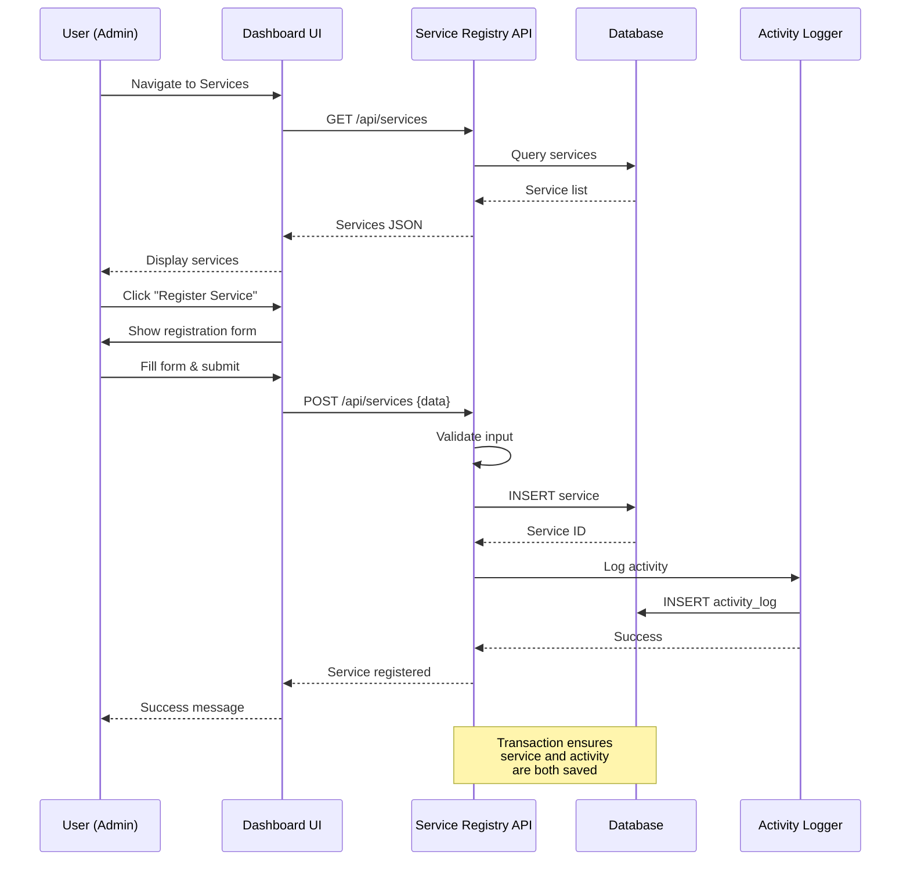

---

## 2. Collect Metrics Sequence

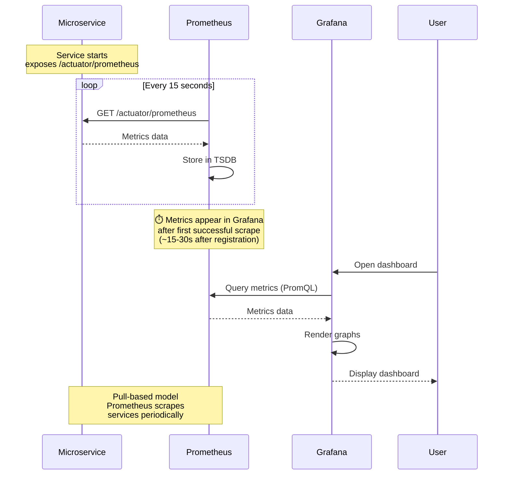

---

## 3. Collect Logs Sequence

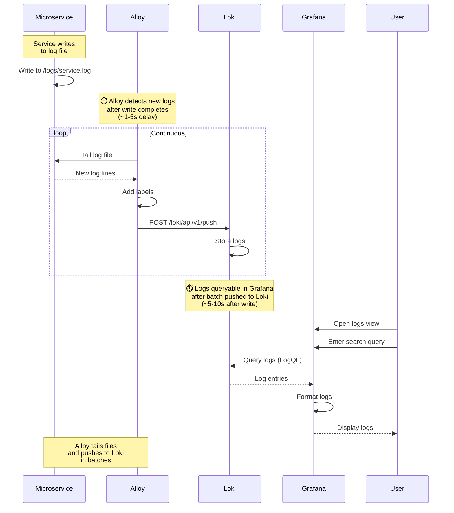

---

## 4. Collect Traces Sequence

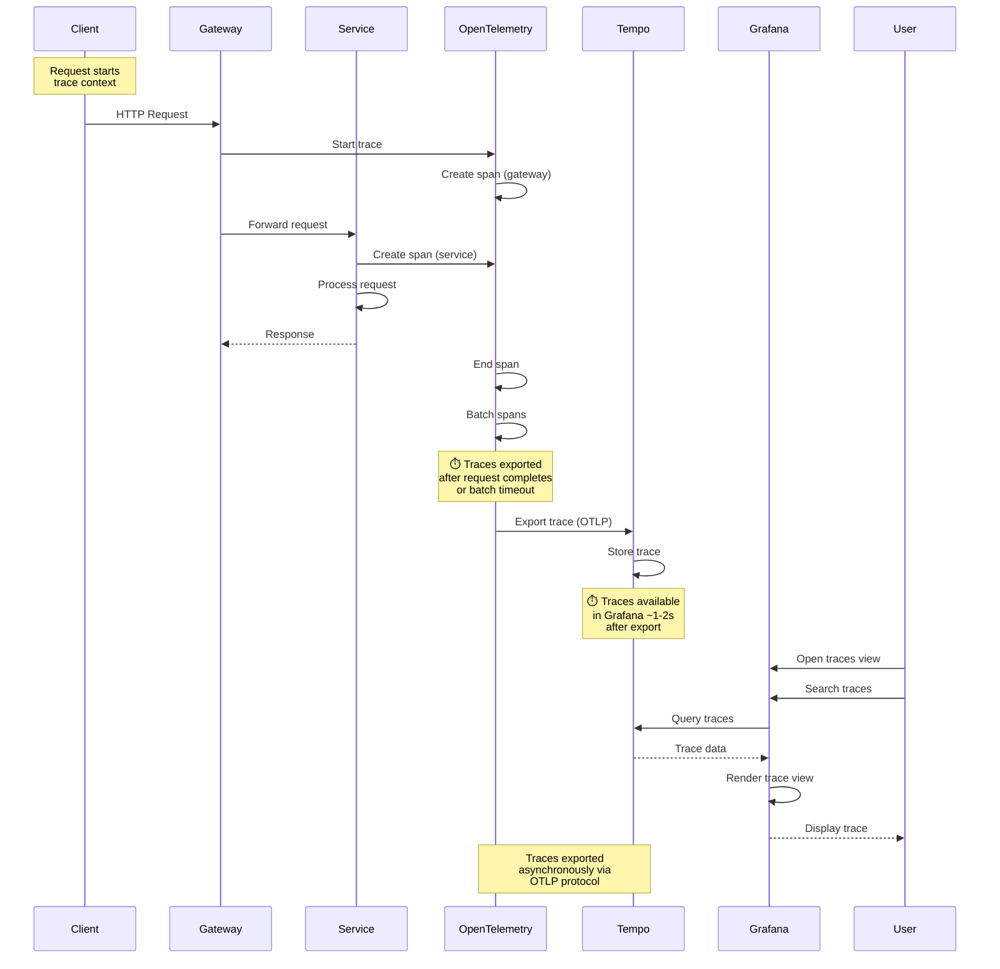

---

## 5. Detect and Create Incident Sequence

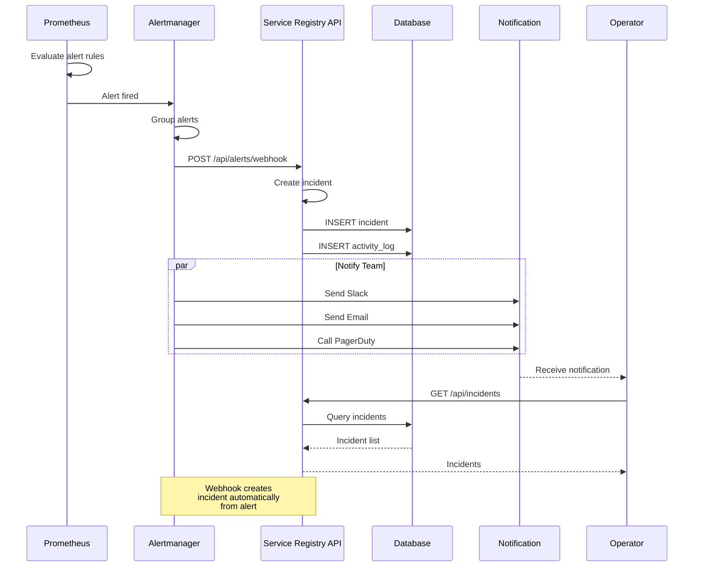

---

## 6. Update Incident Sequence

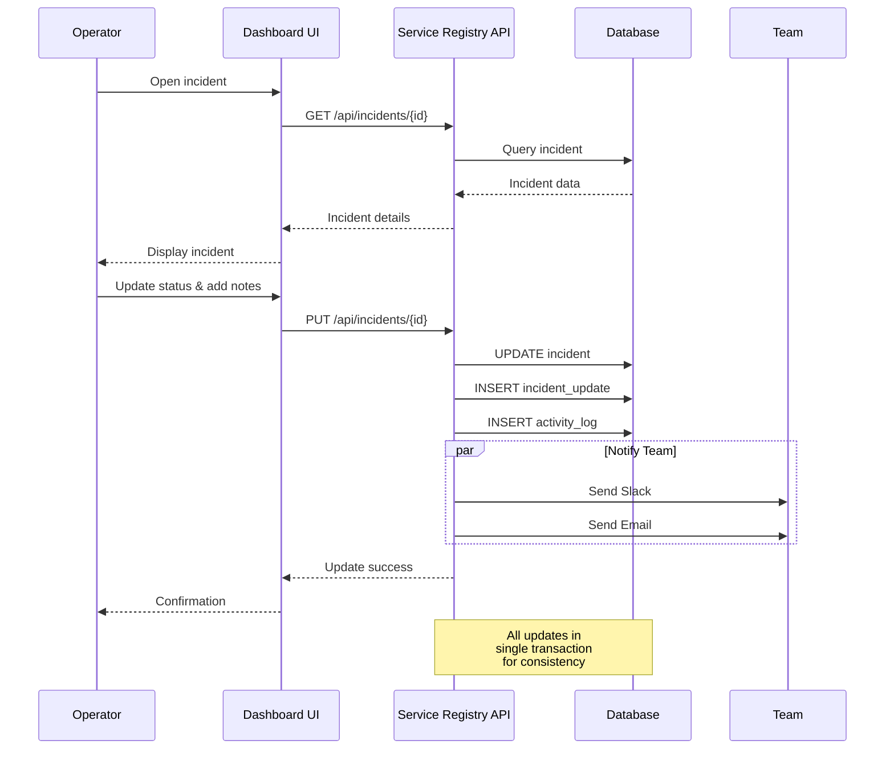

---

## 7. Search Logs Sequence

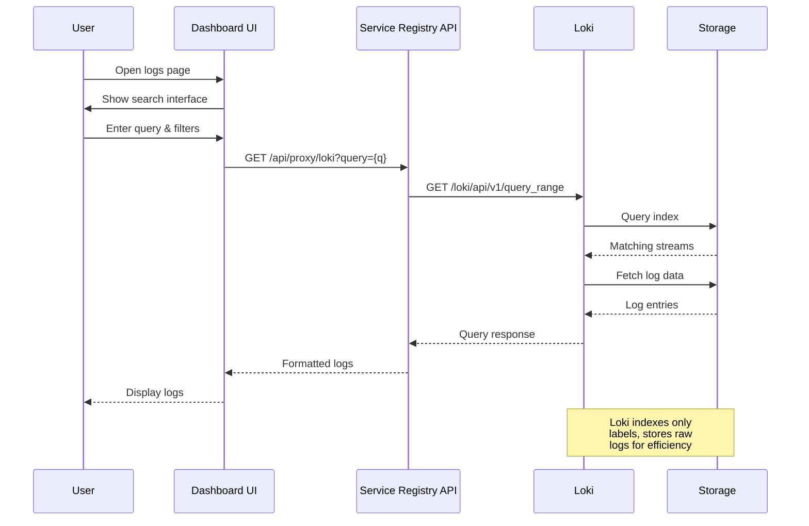

---

## 8. View Trace Details Sequence

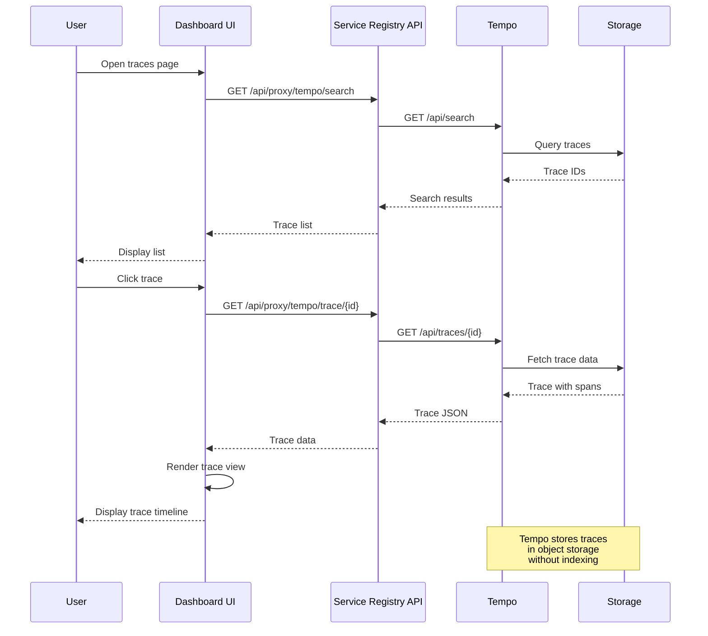

---

## 9. Correlate Data Sequence

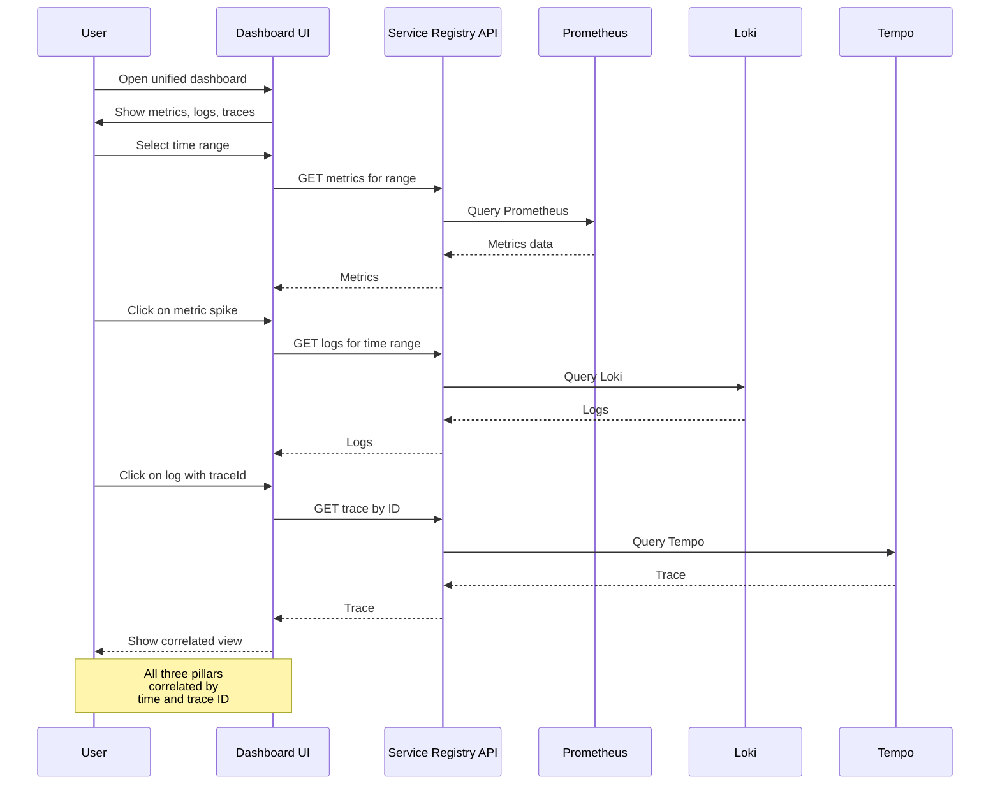

---

## 10. Generate Incident Report Sequence

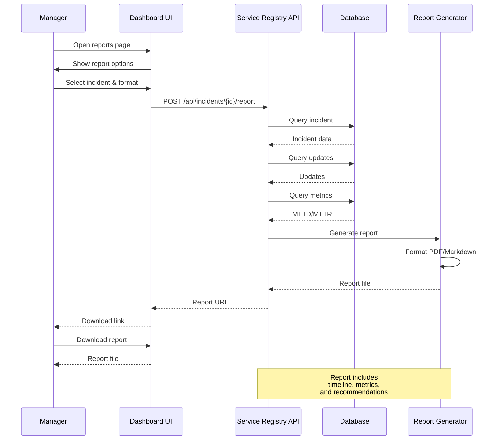

---

## 11. Configure Alert Rule Sequence

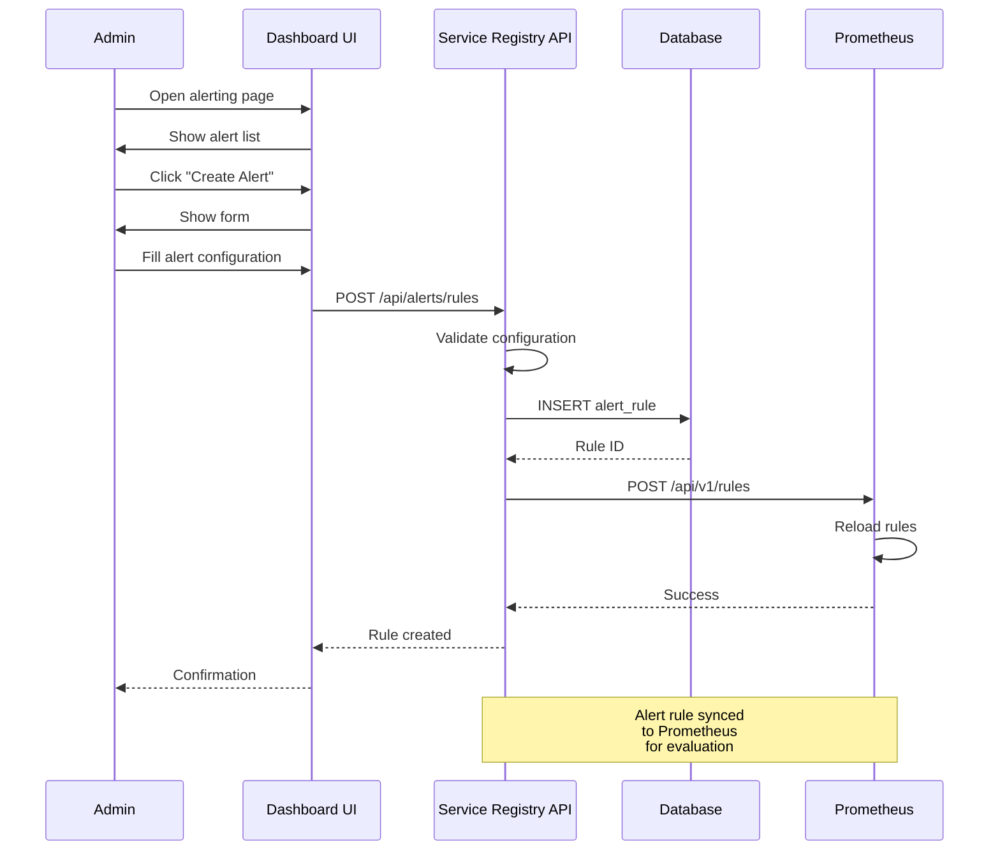

---

## 12. User Authentication Sequence

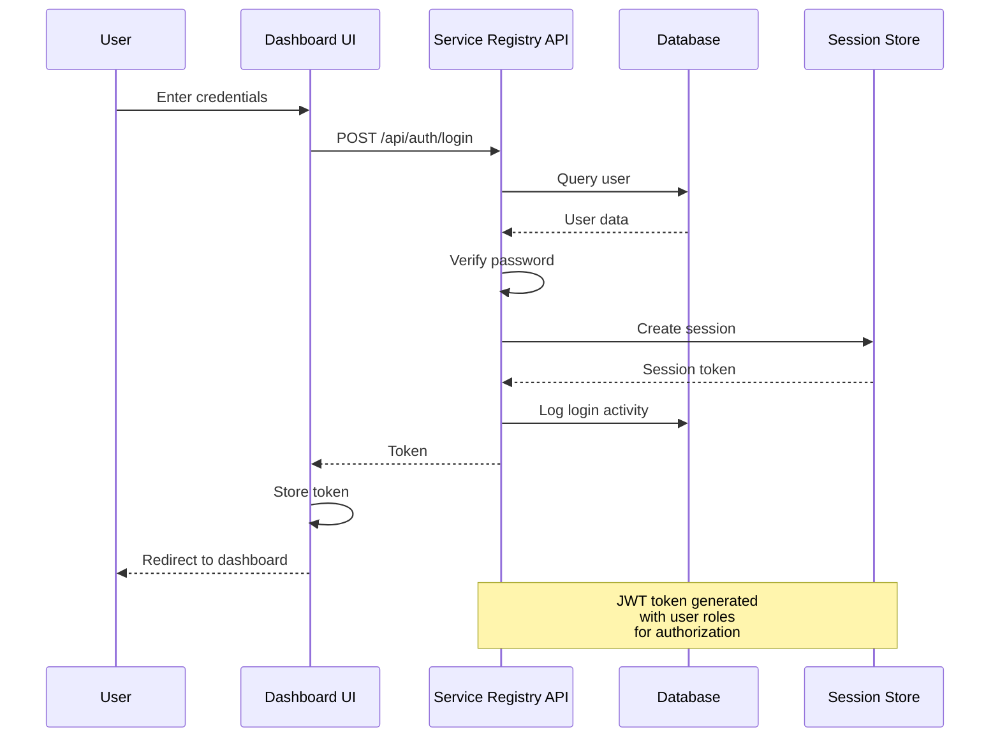

---

## Actor Definitions

| Actor | Description |
|-------|-------------|
| **User (Admin/Operator/Developer/Manager)** | Human user of the system |
| **Dashboard UI** | React/Next.js frontend |
| **Service Registry API** | Spring Boot backend API |
| **Database** | PostgreSQL database |
| **Activity Logger** | Activity logging service |
| **Microservice** | Monitored microservice |
| **Prometheus** | Metrics storage |
| **Alloy** | Log collector |
| **Loki** | Log storage |
| **Tempo** | Trace storage |
| **OpenTelemetry** | Tracing SDK |
| **Alertmanager** | Alert routing |
| **Notification** | Notification service |
| **Report Generator** | Report generation service |
| **Session Store** | Session/token storage |

---

## Document Information

| Field | Value |
|-------|-------|
| **Document** | Sequence Diagrams |
| **Version** | 1.0 |
| **Date** | May 2026 |
| **Author** | [Your Name] |

---

**End of Sequence Diagrams Document**
