# Web Architecture - MicroService Observability Platform
## Built on Existing Demo Project

**Version:** 2.0
**Date:** May 2026
**Based on:** Existing Demo Project (Company, Job, Review, Gateway Services)

---

## Executive Summary

This document describes the web architecture for extending the existing MicroService demo project with a comprehensive observability platform. The architecture allows users to **register and monitor any system** (not just the demo services) through a unified web interface.

### Key Enhancement
**From:** Fixed monitoring of 4 demo services
**To:** Dynamic monitoring of **any user-registered system**

---

## 1. Current Architecture (As-Is)

### 1.1 Current State

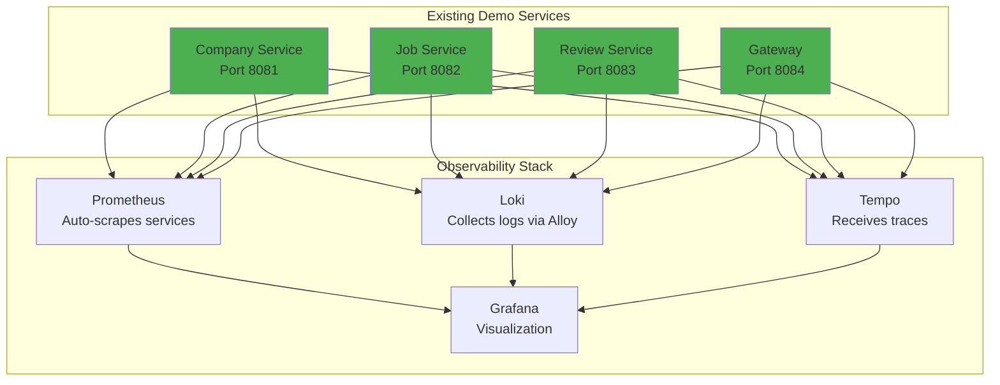

### 1.2 Current Limitations

| Limitation | Impact |
|------------|--------|
| **Fixed Services** | Only 4 demo services monitored |
| **Hardcoded Config** | Service endpoints in Prometheus config |
| **No User Interface** | No way to add new services |
| **Manual Configuration** | Requires YAML editing |
| **No Multi-Tenancy** | No user management |

---

## 2. Proposed Architecture (To-Be)

### 2.1 Enhanced Architecture

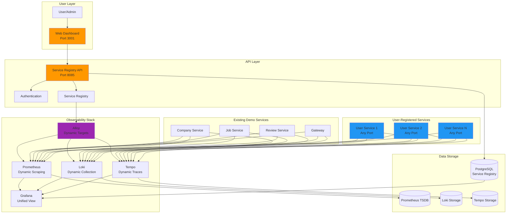

### 2.2 Key Enhancements

| Feature | Before | After |
|---------|--------|-------|
| **Service Registration** | Manual YAML | Web UI + API |
| **Service Count** | Fixed (4) | Unlimited |
| **Configuration** | Static files | Dynamic database |
| **User Access** | None | Role-based access |
| **Target Discovery** | Static | Dynamic (Alloy) |
| **Multi-Tenancy** | No | Yes |

---

## 3. Web Application Architecture

### 3.1 Frontend Architecture

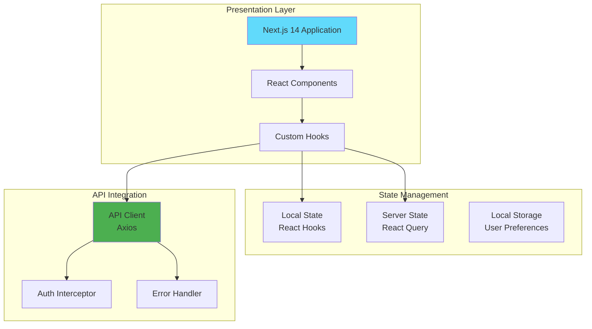

### 3.2 Frontend Pages

```
┌─────────────────────────────────────────────────────────┐
│                  Dashboard Pages                         │
├─────────────────────────────────────────────────────────┤
│  / (Home)              │ System Overview Dashboard      │
│  /services             │ Service Registration & List    │
│  /services/:id         │ Service Details                │
│  /services/register    │ Register New Service           │
│  /incidents            │ Incident Management            │
│  /incidents/:id        │ Incident Details               │
│  /metrics              │ Metrics Explorer               │
│  /logs                 │ Log Search & View              │
│  /traces               │ Trace Explorer                 │
│  /activity             │ Activity Feed                  │
│  /alerts               │ Alert Configuration            │
│  /settings             │ System Settings                │
│  /help                 │ Documentation & Help           │
└─────────────────────────────────────────────────────────┘
```

### 3.3 Component Hierarchy

```
App
├── Layout
│   ├── Sidebar
│   │   ├── Navigation
│   │   └── Service Quick Links
│   └── TopBar
│       ├── User Menu
│       ├── Notifications
│       └── Search
├── Pages
│   ├── Dashboard
│   │   ├── StatsCards
│   │   ├── ServiceHealthMap
│   │   ├── ActiveIncidents
│   │   └── RecentAlerts
│   ├── Services
│   │   ├── ServiceList
│   │   ├── ServiceCard
│   │   ├── ServiceFilter
│   │   └── RegisterServiceModal
│   ├── Incidents
│   │   ├── IncidentList
│   │   ├── IncidentTimeline
│   │   └── IncidentForm
│   └── Observability
│       ├── MetricsPanel
│       ├── LogsPanel
│       └── TracesPanel
└── Shared
    ├── Charts
    ├── Tables
    └── Forms
```

---

## 4. Backend API Architecture

### 4.1 API Layer Design

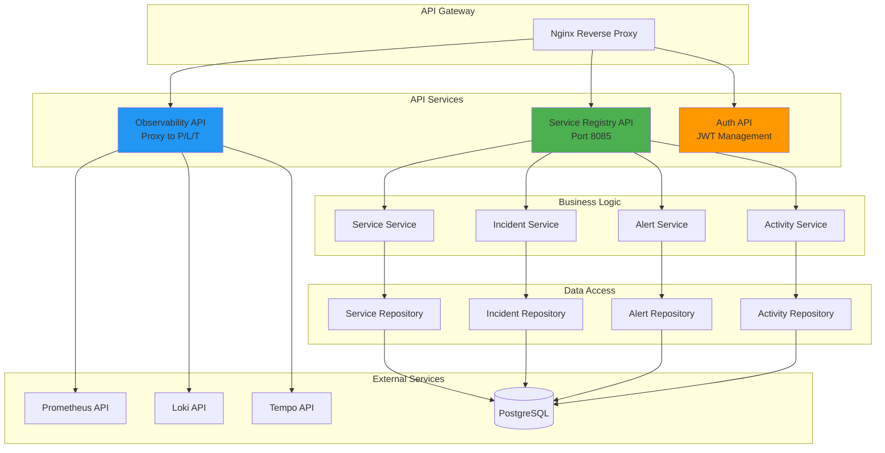

### 4.2 REST API Endpoints

```yaml
# Service Registration API
/api/services:
  get:
    summary: List all registered services
    parameters:
      - type: String (filter by type)
      - status: String (filter by status)
  post:
    summary: Register new service
    body:
      serviceName: String
      serviceType: Enum
      host: String
      port: Integer
      metricsEnabled: Boolean
      logsEnabled: Boolean
      tracingEnabled: Boolean

/api/services/{id}:
  get:
    summary: Get service details
  put:
    summary: Update service
  delete:
    summary: Delete service

/api/services/{id}/health:
  get:
    summary: Get service health status

/api/services/{id}/metrics:
  get:
    summary: Get service metrics

# Incident Management API
/api/incidents:
  get:
    summary: List incidents
  post:
    summary: Create incident

/api/incidents/{id}:
  put:
    summary: Update incident status

# Observability Proxy API
/api/proxy/prometheus:
  get:
    summary: Proxy to Prometheus

/api/proxy/loki:
  get:
    summary: Proxy to Loki

/api/proxy/tempo:
  get:
    summary: Proxy to Tempo
```

---

## 5. Dynamic Service Discovery

### 5.1 Service Discovery Architecture

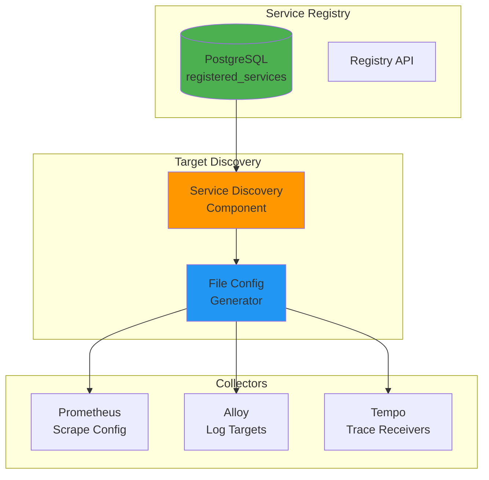

### 5.2 Dynamic Configuration Flow

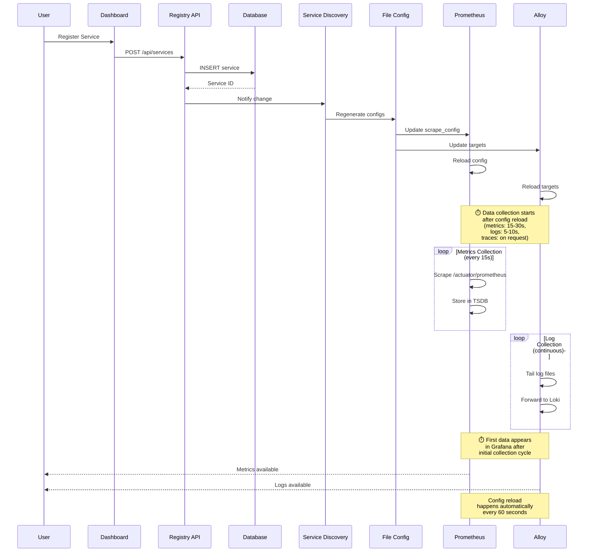

### 5.3 Generated Configuration

**Prometheus Scrape Config (Auto-Generated):**

```yaml
# Auto-generated by Service Discovery
# Do not edit manually

scrape_configs:
  # Static demo services
  - job_name: 'company'
    static_configs:
      - targets: ['company:8081']

  - job_name: 'job'
    static_configs:
      - targets: ['job:8082']

  # Dynamic user-registered services
  - job_name: 'user-services'
    file_sd_configs:
      - files:
          - '/etc/prometheus/targets/user-services.json'
        refresh_interval: 60s
```

**Generated Targets File (`user-services.json`):**

```json
[
  {
    "targets": ["user-service-1:8080"],
    "labels": {
      "service": "user-service-1",
      "type": "microservice",
      "owner": "Team A"
    }
  },
  {
    "targets": ["user-service-2:9000"],
    "labels": {
      "service": "user-service-2",
      "type": "api",
      "owner": "Team B"
    }
  }
]
```

---

## 6. User Management & Multi-Tenancy

### 6.1 User Role Architecture

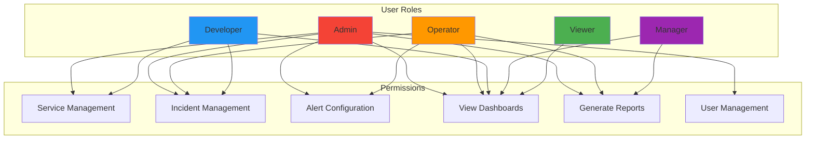

### 6.2 Permission Matrix

| Permission | Admin | Operator | Developer | Manager | Viewer |
|------------|-------|----------|-----------|---------|--------|
| Register Services | ✅ | ❌ | ✅ | ❌ | ❌ |
| Update Services | ✅ | ❌ | ✅ | ❌ | ❌ |
| Delete Services | ✅ | ❌ | ❌ | ❌ | ❌ |
| Create Incidents | ✅ | ✅ | ✅ | ❌ | ❌ |
| Update Incidents | ✅ | ✅ | ✅ | ❌ | ❌ |
| Configure Alerts | ✅ | ✅ | ❌ | ❌ | ❌ |
| View Dashboards | ✅ | ✅ | ✅ | ✅ | ✅ |
| Generate Reports | ✅ | ✅ | ❌ | ✅ | ❌ |
| Manage Users | ✅ | ❌ | ❌ | ❌ | ❌ |

---

## 7. Security Architecture

### 7.1 Authentication Flow

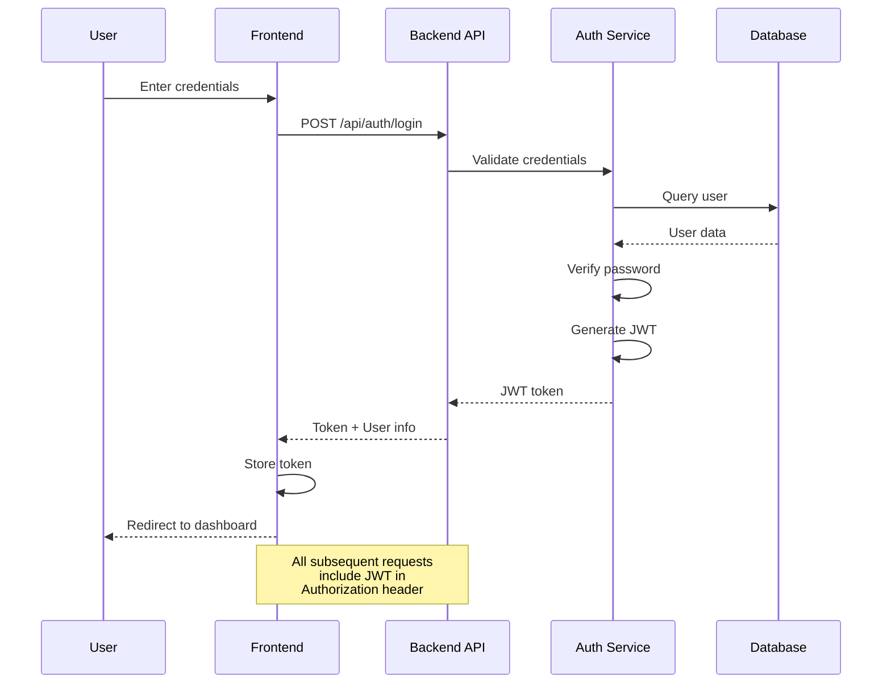

### 7.2 Security Layers

```
┌─────────────────────────────────────────┐
│          Security Architecture          │
├─────────────────────────────────────────┤
│  Layer 1: Network Security              │
│  - HTTPS/TLS                            │
│  - Firewall rules                       │
│  - Network segmentation                 │
├─────────────────────────────────────────┤
│  Layer 2: Application Security          │
│  - JWT Authentication                   │
│  - Role-Based Access Control            │
│  - Input validation                     │
│  - SQL injection prevention             │
├─────────────────────────────────────────┤
│  Layer 3: Data Security                 │
│  - Password hashing (BCrypt)            │
│  - Encrypted connections                │
│  - Audit logging                        │
├─────────────────────────────────────────┤
│  Layer 4: Observability Security        │
│  - Service authentication               │
│  - Metric/Log filtering                 │
│  - Multi-tenancy isolation              │
└─────────────────────────────────────────┘
```

---

## 8. Deployment Architecture

### 8.1 Docker Compose Deployment

```yaml
version: '3.8'

services:
  # Web Application
  dashboard-ui:
    build: ./observability-dashboard-ui
    ports:
      - "3001:3000"
    environment:
      - API_URL=http://service-registry-api:8085

  # API Layer
  service-registry-api:
    build: ./services/service-registry-api
    ports:
      - "8085:8085"
    depends_on:
      - postgres

  # Existing Demo Services
  company:
    image: xoco0508/companyms:latest
    ports:
      - "8081:8081"

  job:
    image: xoco0508/jobms:latest
    ports:
      - "8082:8082"

  review:
    image: xoco0508/reviewms:latest
    ports:
      - "8083:8083"

  gateway:
    image: xoco0508/gateway-ms:latest
    ports:
      - "8084:8084"

  # Observability Stack
  prometheus:
    image: prom/prometheus:latest
    ports:
      - "9090:9090"
    volumes:
      - ./prometheus.yml:/etc/prometheus/prometheus.yml

  loki:
    image: grafana/loki:latest
    ports:
      - "3100:3100"

  tempo:
    image: grafana/tempo:latest
    ports:
      - "3200:3200"

  grafana:
    image: grafana/grafana:latest
    ports:
      - "3000:3000"

  # Database
  postgres:
    image: postgres:15-alpine
    ports:
      - "5432:5432"
    environment:
      - POSTGRES_PASSWORD=observability
```

### 8.2 Production Deployment (Kubernetes)

```mermaid
graph TB
    subgraph "Kubernetes Cluster"
        subgraph "Ingress Layer"
            ING[Nginx Ingress]
        end

        subgraph "Application Tier"
            UI[Dashboard UI<br/>Deployment<br/>3 replicas]
            API[Service Registry API<br/>Deployment<br/>3 replicas]
        end

        subgraph "Observability Tier"
            PROM[Prometheus<br/>StatefulSet]
            LOKI[Loki<br/>StatefulSet]
            TEMPO[Tempo<br/>StatefulSet]
            GRAF[Grafana<br/>Deployment]
        end

        subgraph "Data Tier"
            PG[PostgreSQL<br/>StatefulSet<br/>HA]
        end

        subgraph "Service Discovery"
            SD[Service Discovery<br/>Sidecar]
        end

        ING --> UI
        ING --> API
        ING --> GRAF

        UI --> API
        API --> SD
        SD --> PROM
        SD --> LOKI
        SD --> TEMPO

        API --> PG
        PROM --> PG
        GRAF --> PG

        style UI fill:#61DAFB
        style API fill:#4CAF50
        style SD fill:#FF9800
```

---

## 9. User Journey

### 9.1 Registering a New Service

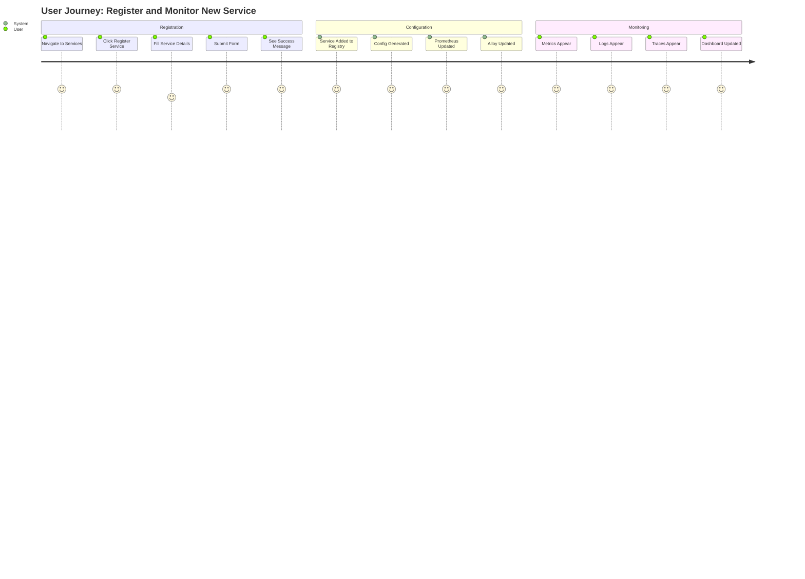

### 9.2 Responding to an Incident

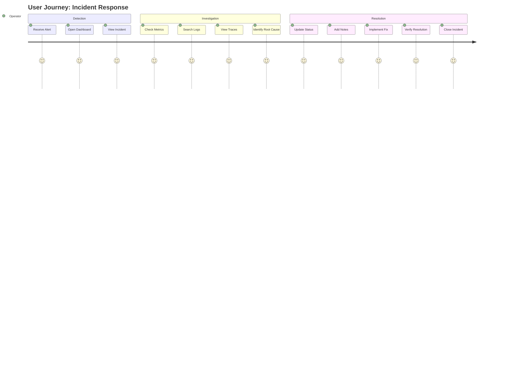

---

## 10. Scalability Considerations

### 10.1 Horizontal Scaling

| Component | Scaling Strategy | Max Replicas |
|-----------|-----------------|--------------|
| Dashboard UI | Stateless, load balanced | 10+ |
| Service Registry API | Stateless, load balanced | 10+ |
| Prometheus | Sharded by service | 5+ |
| Loki | Distributed indexing | 10+ |
| Tempo | Distributed storage | 10+ |
| PostgreSQL | Read replicas | 5+ |

### 10.2 Performance Targets

| Metric | Target | Measurement |
|--------|--------|-------------|
| Dashboard Load Time | < 3 seconds | Page load |
| API Response Time | < 500ms | 95th percentile |
| Service Registration | < 5 seconds | End-to-end |
| Config Propagation | < 60 seconds | DB to collector |
| Metrics Freshness | < 30 seconds | Scrape to display |
| Log Availability | < 10 seconds | Write to queryable |

---

## 11. Integration Points

### 11.1 External Integrations

```
┌─────────────────────────────────────────┐
│         External Integration Points     │
├─────────────────────────────────────────┤
│  Notification Channels:                 │
│  ├── Slack Webhooks                     │
│  ├── Email (SMTP)                       │
│  ├── PagerDuty API                      │
│  └── Microsoft Teams                    │
├─────────────────────────────────────────┤
│  Authentication Providers:              │
│  ├── LDAP/Active Directory              │
│  ├── OAuth2 (Google, GitHub)            │
│  └── SAML 2.0                           │
├─────────────────────────────────────────┤
│  Service Discovery:                     │
│  ├── Kubernetes API                     │
│  ├── Consul                             │
│  ├── etcd                               │
│  └── AWS Service Discovery              │
├─────────────────────────────────────────┤
│  Data Export:                           │
│  ├── Prometheus Remote Write            │
│  ├── S3/GCS for logs                    │
│  └── Webhook for alerts                 │
└─────────────────────────────────────────┘
```

---

## 12. Migration from Existing Demo

### 12.1 Migration Steps

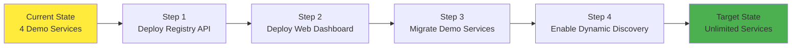

### 12.2 Backward Compatibility

| Feature | Before | After | Compatible |
|---------|--------|-------|------------|
| Demo Services | Hardcoded | Registered | ✅ Yes |
| Prometheus Config | Static | Dynamic + Static | ✅ Yes |
| Grafana Dashboards | Manual | Auto-generated | ✅ Yes |
| Alert Rules | YAML | UI + YAML | ✅ Yes |

---

## Document Information

| Field | Value |
|-------|-------|
| **Document** | Web Architecture |
| **Version** | 2.0 |
| **Based On** | Existing Demo Project |
| **Date** | May 2026 |
| **Author** | [Your Name] |

---

**End of Web Architecture Document**
