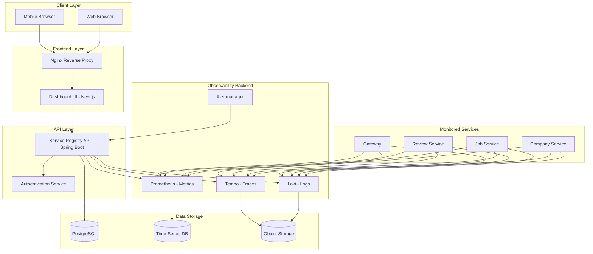
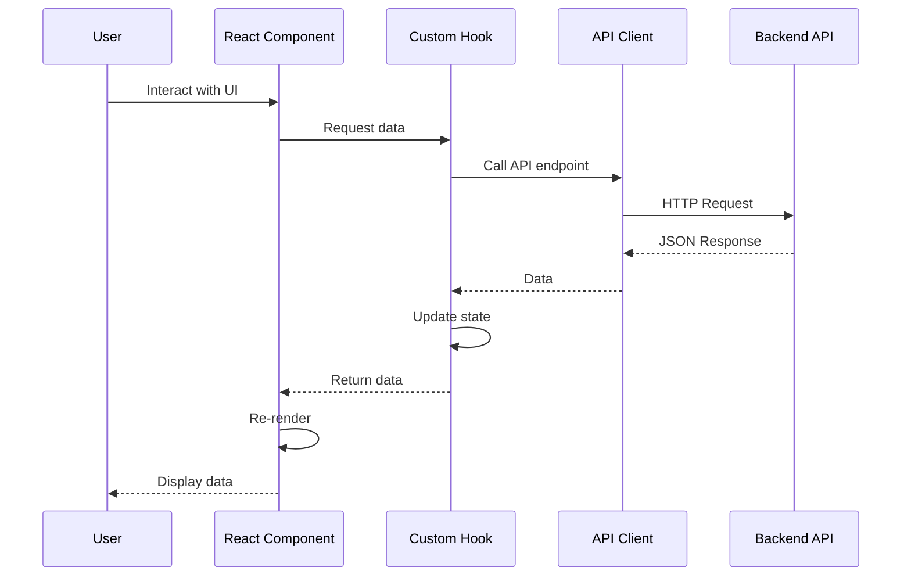
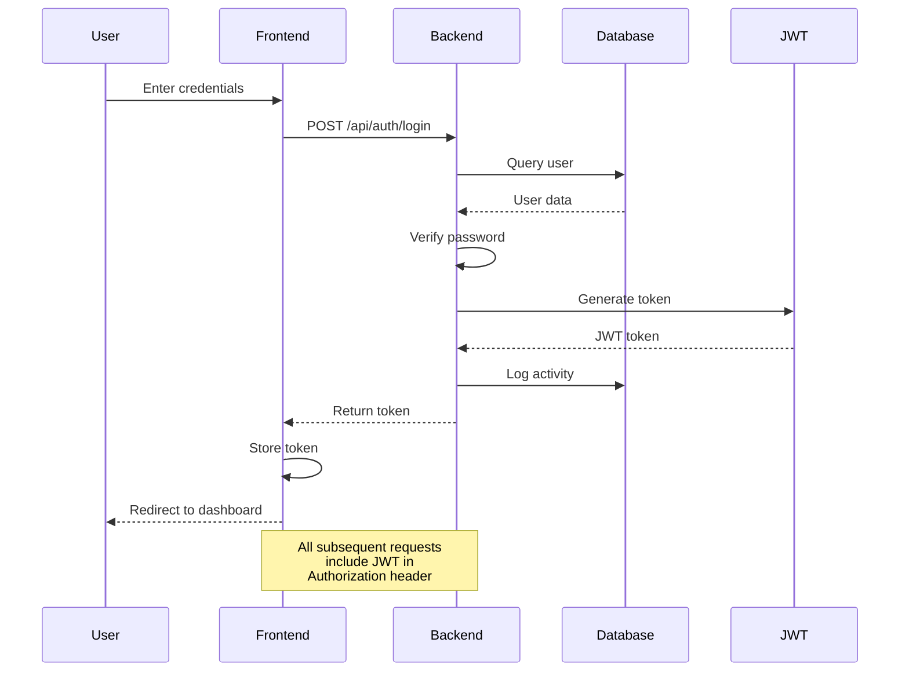
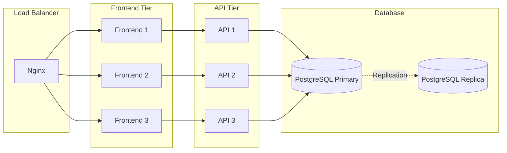

# Website Architecture - Incident Management System Platform

## System Overview

This document describes the overall architecture of the Incident Management System Platform, including frontend, backend, and infrastructure components.

---

## High-Level Architecture



---

## Frontend Architecture

### **Technology Stack**

```
┌─────────────────────────────────────┐
│         Dashboard UI                │
│  Next.js 14 + React 18 + TypeScript │
├─────────────────────────────────────┤
│  Styling: Tailwind CSS              │
│  State: React Hooks                 │
│  Charts: Recharts                   │
│  Icons: Lucide React                │
└─────────────────────────────────────┘
```

### **Frontend Directory Structure**

```
observability-dashboard-ui/
├── src/
│   ├── app/
│   │   ├── layout.tsx              # Root layout
│   │   ├── page.tsx                # Home page (Dashboard)
│   │   ├── services/
│   │   │   └── page.tsx            # Services page
│   │   ├── incidents/
│   │   │   └── page.tsx            # Incidents page
│   │   ├── logs/
│   │   │   └── page.tsx            # Logs page
│   │   ├── metrics/
│   │   │   └── page.tsx            # Metrics page
│   │   ├── traces/
│   │   │   └── page.tsx            # Traces page
│   │   ├── activity/
│   │   │   └── page.tsx            # Activity page
│   │   ├── settings/
│   │   │   └── page.tsx            # Settings page
│   │   └── help/
│   │       └── page.tsx            # Help page
│   ├── components/
│   │   ├── Sidebar.tsx             # Navigation sidebar
│   │   ├── TopBar.tsx              # Top navigation bar
│   │   ├── StatsCard.tsx           # Statistics card
│   │   ├── ServiceList.tsx         # Service list
│   │   ├── IncidentList.tsx        # Incident list
│   │   └── ActivityFeed.tsx        # Activity feed
│   ├── lib/
│   │   ├── api.ts                  # API client
│   │   └── utils.ts                # Utility functions
│   └── hooks/
│       ├── useServices.ts          # Services hook
│       ├── useIncidents.ts         # Incidents hook
│       └── useMetrics.ts           # Metrics hook
├── public/
├── package.json
├── next.config.js
├── tailwind.config.js
└── tsconfig.json
```

### **Frontend Data Flow**



---

## Backend Architecture

### **Technology Stack**

```
┌─────────────────────────────────────┐
│      Service Registry API           │
│     Spring Boot 4 + Java 17         │
├─────────────────────────────────────┤
│  Persistence: Spring Data JPA       │
│  Database: PostgreSQL 15            │
│  Security: Spring Security + JWT    │
│  API Docs: OpenAPI/Swagger          │
└─────────────────────────────────────┘
```

### **Backend Directory Structure**

```
services/service-registry-api/
├── src/main/java/
│   └── com/registry/serviceregistryapi/
│       ├── ServiceRegistryApiApplication.java
│       ├── config/
│       │   ├── SecurityConfig.java
│       │   ├── CorsConfig.java
│       │   └── OpenApiConfig.java
│       ├── controller/
│       │   ├── ServiceController.java
│       │   ├── IncidentController.java
│       │   ├── AlertController.java
│       │   ├── ActivityController.java
│       │   └── ProxyController.java
│       ├── service/
│       │   ├── RegisteredServiceService.java
│       │   ├── IncidentService.java
│       │   ├── AlertService.java
│       │   └── ActivityService.java
│       ├── repository/
│       │   ├── RegisteredServiceRepository.java
│       │   ├── IncidentRepository.java
│       │   ├── AlertRepository.java
│       │   └── ActivityRepository.java
│       ├── model/
│       │   ├── RegisteredService.java
│       │   ├── Incident.java
│       │   ├── Alert.java
│       │   └── ActivityLog.java
│       └── dto/
│           ├── request/
│           │   └── RegisterServiceRequest.java
│           └── response/
│               └── ServiceResponse.java
├── src/main/resources/
│   ├── application.properties
│   └── application-docker.properties
├── pom.xml
└── Dockerfile
```

### **Backend API Endpoints**

```
┌────────────────────────────────────────────────────────┐
│                    API Endpoints                        │
├────────────────────────────────────────────────────────┤
│  Services                                              │
│  ├── GET    /api/services           # List services   │
│  ├── POST   /api/services           # Register        │
│  ├── GET    /api/services/:id       # Get service     │
│  ├── PUT    /api/services/:id       # Update          │
│  └── DELETE /api/services/:id       # Delete          │
├────────────────────────────────────────────────────────┤
│  Incidents                                             │
│  ├── GET    /api/incidents          # List incidents  │
│  ├── POST   /api/incidents          # Create          │
│  ├── PUT    /api/incidents/:id      # Update          │
│  └── POST   /api/incidents/:id/report # Generate      │
├────────────────────────────────────────────────────────┤
│  Alerts                                                │
│  ├── GET    /api/alerts            # List alerts      │
│  ├── POST   /api/alerts/webhook    # Webhook          │
│  ├── GET    /api/alerts/rules      # List rules       │
│  └── POST   /api/alerts/rules      # Create rule      │
├────────────────────────────────────────────────────────┤
│  Proxy                                                 │
│  ├── GET    /api/proxy/loki        # Loki proxy       │
│  └── GET    /api/proxy/tempo       # Tempo proxy      │
├────────────────────────────────────────────────────────┤
│  Activity                                              │
│  ├── GET    /api/activities        # List activities  │
│  └── POST   /api/activities        # Log activity     │
└────────────────────────────────────────────────────────┘
```

---

## Observability Backend

### **Prometheus (Metrics)**

```yaml
# Architecture
┌──────────────┐
│  Scrapers    │
│  (15s interval)│
└──────┬───────┘
│
▼
┌──────────────┐
│  Prometheus  │
│   Server     │
└──────┬───────┘
│
▼
┌──────────────┐
│   Time-Series│
│   Database   │
└──────────────┘
```

**Configuration:**

- Scrape interval: 15 seconds
- Retention: 30 days
- Storage: Local filesystem
- Query: PromQL

---

### **Loki (Logs)**

```yaml
# Architecture
┌──────────────┐
│   Alloy      │
│  (Collector) │
└──────┬───────┘
│
▼
┌──────────────┐
│     Loki     │
│   Aggregator │
└──────┬───────┘
│
▼
┌──────────────┐
│  Object Store│
│  (Logs)      │
└──────────────┘
```

**Configuration:**

- Collection: File tailing
- Retention: 7 days
- Storage: Compressed chunks
- Query: LogQL

---

### **Tempo (Traces)**

```yaml
# Architecture
┌──────────────┐
│ OpenTelemetry│
│   Exporters  │
└──────┬───────┘
│
▼
┌──────────────┐
│     Tempo    │
│   Receiver   │
└──────┬───────┘
│
▼
┌──────────────┐
│  Object Store│
│  (Traces)    │
└──────────────┘
```

**Configuration:**

- Protocol: OTLP (HTTP/gRPC)
- Retention: 7 days
- Storage: Local backend
- Query: TraceQL

---

## Infrastructure Architecture

### **Docker Compose Deployment**

```yaml
# Single Server Deployment
┌─────────────────────────────────────────┐
│           Docker Host                   │
│                                         │
│  ┌─────────────────────────────────┐   │
│  │      Docker Network             │   │
│  │                                 │   │
│  │  ┌──────────┐  ┌──────────    │   │
│  │  │ Frontend │  │  Nginx   │    │   │
│  │  │   :3000  │  │  :80     │    │   │
│  │  └──────────┘  └──────────    │   │
│  │                                 │   │
│  │  ┌──────────┐  ┌──────────┐    │   │
│  │  │   API    │  │   Auth   │    │   │
│  │  │  :8085   │  │          │    │   │
│  │  └──────────  └──────────┘    │   │
│  │                                 │   │
│  │  ┌──────────┐  ┌──────────┐    │   │
│  │  │Prometheus│  │  Grafana │    │   │
│  │  │  :9090   │  │  :3000   │    │   │
│  │  └──────────┘  └──────────    │   │
│  │                                 │   │
│  │  ┌──────────┐  ┌──────────┐    │   │
│  │  │   Loki   │  │  Tempo   │    │   │
│  │  │  :3100   │  │  :3200   │    │   │
│  │  └──────────┘  └──────────    │   │
│  │                                 │   │
│  │  ┌──────────┐  ┌──────────┐    │   │
│  │  │PostgreSQL│  │ Alertmgr │    │   │
│  │  │  :5432   │  │  :9093   │    │   │
│  │  └──────────  └──────────┘    │   │
│  └─────────────────────────────────┘   │
└─────────────────────────────────────────┘
```

---

## Security Architecture

### **Authentication Flow**



### **Authorization Model**

```
┌─────────────────────────────────────────┐
│           Role-Based Access Control     │
├─────────────────────────────────────────┤
│  ADMIN     │ Full access                │
│  OPERATOR  │ Incident management        │
│  DEVELOPER │ Service debugging          │
│  MANAGER   │ Reports & analytics        │
│  VIEWER    │ Read-only access           │
└─────────────────────────────────────────┘
```

---

## Data Flow Architecture

### **Metrics Data Flow**

```
Service → Actuator → Prometheus → TSDB → Grafana
                              ↓
                          Alertmanager
                              ↓
                         Notification
```

### **Logs Data Flow**

```
Service → Log File → Alloy → Loki → Storage → Grafana
```

### **Traces Data Flow**

```
Service → OpenTelemetry → Tempo → Storage → Grafana
```

---

## Scalability Architecture

### **Horizontal Scaling**



---

## Deployment Architecture

### **Production Deployment**

```
┌──────────────────────────────────────────────────┐
│              Cloud Provider                       │
│                                                  │
│  ┌────────────────────────────────────────┐     │
│  │         Kubernetes Cluster             │     │
│  │                                        │     │
│  │  ┌──────────────┐  ┌──────────────┐   │     │
│  │  │   Frontend   │  │     API      │   │     │
│  │  │  Deployment  │  │  Deployment  │   │     │
│  │  │  (3 pods)    │  │   (3 pods)   │   │     │
│  │  └──────────────┘  └──────────────┘   │     │
│  │                                        │     │
│  │  ┌──────────────┐  ┌──────────────┐   │     │
│  │  │  Prometheus  │  │    Loki      │   │     │
│  │  │  StatefulSet │  │ StatefulSet  │   │     │
│  │  └──────────────┘  └──────────────┘   │     │
│  │                                        │     │
│  │  ┌──────────────┐  ┌──────────────┐   │     │
│  │  │    Tempo     │  │  PostgreSQL  │   │     │
│  │  │ StatefulSet  │  │ StatefulSet  │   │     │
│  │  └──────────────┘  └──────────────┘   │     │
│  └────────────────────────────────────────┘     │
└──────────────────────────────────────────────────┘
```

---

## Monitoring Architecture

### **Self-Monitoring**

```
┌─────────────────────────────────────────┐
│         Platform Monitoring             │
├─────────────────────────────────────────┤
│  Infrastructure:                        │
│  - CPU, Memory, Disk usage              │
│  - Network I/O                          │
│  - Container health                     │
├─────────────────────────────────────────┤
│  Application:                           │
│  - Request rate                         │
│  - Error rate                           │
│  - Response time                        │
│  - Database connections                 │
├─────────────────────────────────────────┤
│  Business:                              │
│  - Active users                         │
│  - Incidents created                    │
│  - MTTD / MTTR                          │
└─────────────────────────────────────────┘
```

---

## Document Information

| Field        | Value                |
| ------------ | -------------------- |
| **Document** | Website Architecture |
| **Version**  | 1.0                  |
| **Date**     | May 2026             |
| **Author**   | [Your Name]          |

---

**End of Website Architecture Document**
